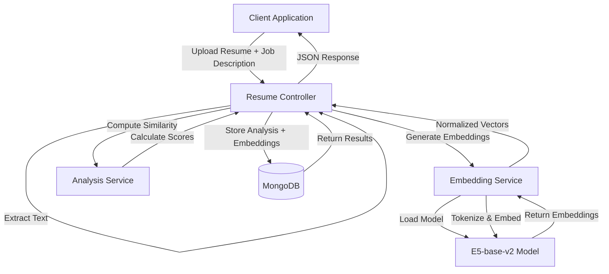
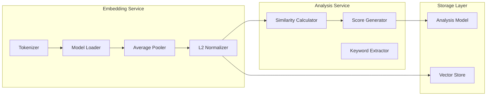
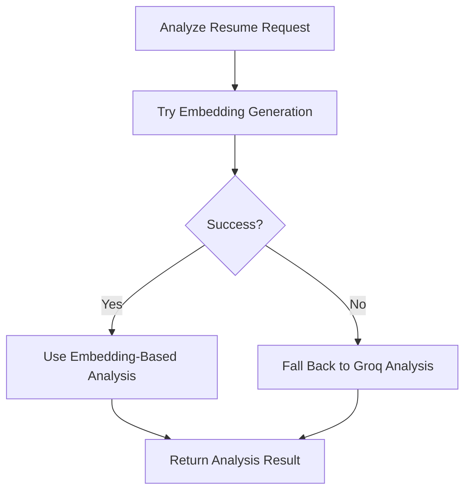

# Design Document: Vector Embedding Resume Analysis

## Overview

This design specifies the implementation of the E5-base-v2 transformer model for semantic resume analysis in the existing JavaScript/Node.js backend. The system will replace direct LLM API calls with a vector embedding-based approach that provides improved semantic understanding through transformer-based embeddings.

### Goals

1. **Semantic Understanding**: Use the intfloat/e5-base-v2 model to generate high-quality embeddings for resumes and job descriptions
2. **Performance**: Achieve embedding generation in under 500ms for typical resume/job description lengths
3. **Integration**: Seamlessly integrate with the existing Express/MongoDB architecture
4. **Backward Compatibility**: Maintain existing API contracts and Analysis model schema
5. **Scalability**: Support batch processing and model caching for efficient multi-request handling

### Non-Goals

1. Training or fine-tuning the E5 model (we use the pre-trained model as-is)
2. Replacing the entire Groq-based analysis pipeline immediately (gradual migration)
3. Implementing custom transformer architectures
4. Supporting models other than E5-base-v2 in the initial release

### Technology Stack

- **Model**: intfloat/e5-base-v2 (BERT-based transformer, 768-dimensional embeddings)
- **Runtime**: @xenova/transformers (Transformer.js) for JavaScript-native execution
- **Fallback**: onnxruntime-node for ONNX model execution if needed
- **Storage**: MongoDB with array fields for 768-dimensional vectors
- **Framework**: Express.js (existing)
- **Language**: JavaScript (ES modules)

## Architecture

### High-Level Architecture



### Component Architecture



### Data Flow

1. **Resume Upload**: Client uploads PDF resume with optional job description
2. **Text Extraction**: PDF is parsed to extract plain text
3. **Prefix Application**: Resume text gets "passage: " prefix, job description gets "query: " prefix
4. **Tokenization**: Text is tokenized with max_length=512, attention masks generated
5. **Model Inference**: E5 model generates hidden states for token sequences
6. **Average Pooling**: Hidden states are pooled using attention mask weighting
7. **L2 Normalization**: Pooled embeddings are normalized to unit length
8. **Similarity Computation**: Cosine similarity computed via dot product of normalized embeddings
9. **Score Generation**: ATS score and analysis metrics derived from similarity scores
10. **Persistence**: Analysis results and embeddings stored in MongoDB
11. **Response**: JSON response returned to client with analysis results

## Components and Interfaces

### 1. Embedding Service (`src/services/embedding.service.js`)

**Responsibility**: Load E5 model, generate embeddings, normalize vectors

**Interface**:

```javascript
class EmbeddingService {
  /**
   * Initialize the embedding service and load the E5 model
   * @throws {Error} If model loading fails
   */
  async initialize();

  /**
   * Generate embedding for a query (job description, search query)
   * @param {string} text - Input text
   * @returns {Promise<Float32Array>} 768-dimensional normalized embedding
   * @throws {Error} If text is invalid or embedding generation fails
   */
  async embedQuery(text);

  /**
   * Generate embedding for a passage (resume text, document)
   * @param {string} text - Input text
   * @returns {Promise<Float32Array>} 768-dimensional normalized embedding
   * @throws {Error} If text is invalid or embedding generation fails
   */
  async embedPassage(text);

  /**
   * Generate embeddings for multiple texts in batch
   * @param {string[]} texts - Array of input texts
   * @param {'query'|'passage'} mode - Embedding mode
   * @returns {Promise<Float32Array[]>} Array of normalized embeddings
   * @throws {Error} If any text is invalid or batch processing fails
   */
  async batchEmbed(texts, mode);

  /**
   * Compute cosine similarity between two embeddings
   * @param {Float32Array} embedding1 - First embedding
   * @param {Float32Array} embedding2 - Second embedding
   * @returns {number} Similarity score in range [-1, 1]
   * @throws {Error} If embeddings have mismatched dimensions
   */
  computeSimilarity(embedding1, embedding2);

  /**
   * Internal: Apply average pooling to hidden states
   * @private
   */
  _averagePool(hiddenStates, attentionMask);

  /**
   * Internal: Apply L2 normalization to embedding
   * @private
   */
  _l2Normalize(embedding);
}
```

**Configuration**:

```javascript
const EMBEDDING_CONFIG = {
  modelId: 'Xenova/e5-base-v2',
  maxLength: 512,
  embeddingDim: 768,
  queryPrefix: 'query: ',
  passagePrefix: 'passage: ',
  device: process.env.EMBEDDING_DEVICE || 'cpu', // 'cpu' or 'gpu'
  batchSize: parseInt(process.env.EMBEDDING_BATCH_SIZE) || 8,
};
```

### 2. Analysis Service (`src/services/analysis.service.js`)

**Responsibility**: Compute similarity scores, generate ATS scores, extract keywords

**Interface**:

```javascript
class AnalysisService {
  /**
   * Analyze resume against job description using embeddings
   * @param {Float32Array} resumeEmbedding - Resume embedding
   * @param {Float32Array} jobEmbedding - Job description embedding
   * @param {string} resumeText - Original resume text
   * @param {string} jobDescription - Original job description
   * @returns {Promise<Object>} Analysis results
   */
  async analyzeWithEmbeddings(resumeEmbedding, jobEmbedding, resumeText, jobDescription);

  /**
   * Generate ATS score from similarity score
   * @param {number} similarity - Cosine similarity score
   * @returns {Object} { score: number, level: string }
   */
  generateATSScore(similarity);

  /**
   * Extract keywords using embedding-based semantic matching
   * @param {string} text - Input text
   * @param {Float32Array} embedding - Text embedding
   * @returns {Promise<string[]>} Extracted keywords
   */
  async extractKeywords(text, embedding);

  /**
   * Identify missing skills by comparing embeddings
   * @param {string[]} resumeSkills - Skills detected in resume
   * @param {string[]} jobSkills - Skills required in job description
   * @param {Float32Array} resumeEmbedding - Resume embedding
   * @param {Float32Array} jobEmbedding - Job description embedding
   * @returns {Promise<string[]>} Missing skills
   */
  async identifyMissingSkills(resumeSkills, jobSkills, resumeEmbedding, jobEmbedding);
}
```

### 3. Resume Controller Updates (`src/controllers/resume.controller.js`)

**Updated Method**:

```javascript
export const analyzeResume = async (req, res) => {
  try {
    // 1. Extract PDF text (existing logic)
    const resumeText = await extractPDFText(req.file.path);

    // 2. Generate embeddings
    const embeddingService = EmbeddingService.getInstance();
    const resumeEmbedding = await embeddingService.embedPassage(resumeText);
    const jobEmbedding = req.body.jobDescription
      ? await embeddingService.embedQuery(req.body.jobDescription)
      : null;

    // 3. Compute similarity and generate analysis
    const analysisService = new AnalysisService();
    const analysis = await analysisService.analyzeWithEmbeddings(
      resumeEmbedding,
      jobEmbedding,
      resumeText,
      req.body.jobDescription || ''
    );

    // 4. Store in MongoDB with embeddings
    const savedAnalysis = await Analysis.create({
      user: req.userId,
      fileName: req.file.originalname,
      companyName: req.body.companyName || '',
      jobTitle: req.body.jobTitle || '',
      jobDescription: req.body.jobDescription || '',
      resumeEmbedding: Array.from(resumeEmbedding),
      jobEmbedding: jobEmbedding ? Array.from(jobEmbedding) : null,
      ...analysis,
    });

    // 5. Return response
    return res.status(201).json({
      success: true,
      analysis: serializeAnalysis(savedAnalysis),
    });
  } catch (error) {
    console.error('Resume analysis error:', error);
    return res.status(500).json({
      success: false,
      message: 'Resume analysis failed',
    });
  }
};
```

### 4. MongoDB Schema Updates (`src/models/Analysis.js`)

**New Fields**:

```javascript
const analysisSchema = new mongoose.Schema({
  // ... existing fields ...
  
  resumeEmbedding: {
    type: [Number],
    default: null,
    validate: {
      validator: function(v) {
        return v === null || v.length === 768;
      },
      message: 'Resume embedding must be 768-dimensional'
    }
  },
  
  jobEmbedding: {
    type: [Number],
    default: null,
    validate: {
      validator: function(v) {
        return v === null || v.length === 768;
      },
      message: 'Job embedding must be 768-dimensional'
    }
  },
  
  similarityScore: {
    type: Number,
    default: null,
    min: -1,
    max: 1
  }
}, { timestamps: true });

// Index for vector similarity queries (future use)
analysisSchema.index({ resumeEmbedding: 1 });
```

## Correctness Properties

*A property is a characteristic or behavior that should hold true across all valid executions of a system—essentially, a formal statement about what the system should do. Properties serve as the bridge between human-readable specifications and machine-verifiable correctness guarantees.*

### Property 1: Embedding Dimension Invariant

*For any* valid text input, the generated embedding SHALL have exactly 768 dimensions.

**Validates: Requirements 4.4, 4.5, 15.2**

### Property 2: L2 Normalization Unit Length

*For any* non-zero embedding vector, after L2 normalization, the L2 norm of the normalized embedding SHALL equal 1.0 within floating-point precision (±1e-6).

**Validates: Requirements 5.4, 5.5, 15.3**

### Property 3: Tokenization Length Limit

*For any* text input, the tokenized sequence length SHALL NOT exceed 512 tokens.

**Validates: Requirements 2.2**

### Property 4: Query Prefix Application

*For any* text passed to `embedQuery()`, the string "query: " SHALL be prepended before tokenization.

**Validates: Requirements 3.1, 3.3**

### Property 5: Passage Prefix Application

*For any* text passed to `embedPassage()`, the string "passage: " SHALL be prepended before tokenization.

**Validates: Requirements 3.2, 3.3**

### Property 6: Attention Mask Consistency

*For any* tokenized sequence, the attention mask length SHALL equal the token sequence length.

**Validates: Requirements 2.5**

### Property 7: Cosine Similarity Range

*For any* two embeddings, the computed cosine similarity SHALL be in the range [-1, 1].

**Validates: Requirements 6.2**

### Property 8: Identical Embedding Similarity

*For any* embedding, the cosine similarity with itself SHALL equal 1.0 within floating-point precision (±1e-6).

**Validates: Requirements 6.5**

### Property 9: Normalized Embedding Dot Product Equivalence

*For any* two L2-normalized embeddings, the dot product SHALL equal the cosine similarity.

**Validates: Requirements 6.4**

### Property 10: Batch Embedding Consistency

*For any* array of texts, batch embedding generation SHALL produce the same embeddings as individual embedding generation for each text.

**Validates: Requirements 9.4, 10.2**

### Property 11: ATS Score Range

*For any* similarity score, the generated ATS score SHALL be in the range [0, 100].

**Validates: Requirements 7.5, 12.3**

### Property 12: Embedding Mode Support

*For any* valid text, both `embedQuery()` and `embedPassage()` SHALL successfully generate valid 768-dimensional normalized embeddings.

**Validates: Requirements 1.3**

### Property 13: Storage Format Consistency

*For any* embedding stored in MongoDB, it SHALL be stored as an array of exactly 768 floating-point numbers.

**Validates: Requirements 8.3**

### Property 14: Configuration Respect

*For any* valid maximum token length configuration, tokenization SHALL enforce that limit and produce sequences not exceeding the configured length.

**Validates: Requirements 14.2**

### Property 15: Embedding Retrieval Round-Trip

*For any* analysis created with embeddings, retrieving the analysis from MongoDB SHALL return embeddings with the same dimensions and values (within floating-point precision).

**Validates: Requirements 8.4**

### Property 16: Normalization Idempotence

*For any* embedding, normalizing it twice SHALL produce the same result as normalizing it once (within floating-point precision).

**Validates: Requirements 5.2**

### Property 17: Zero Vector Handling

*For any* zero embedding vector, L2 normalization SHALL return a zero vector.

**Validates: Requirements 5.3**

### Property 18: Special Token Presence

*For any* tokenized text, the token sequence SHALL contain CLS (classification) and SEP (separator) special tokens as required by BERT architecture.

**Validates: Requirements 2.4**

### Property 19: Pooling Dimension Preservation

*For any* hidden states from the model, average pooling SHALL produce an output with 768 dimensions.

**Validates: Requirements 4.4**

### Property 20: Similarity Symmetry

*For any* two embeddings A and B, the similarity of A with B SHALL equal the similarity of B with A.

**Validates: Requirements 6.1**

## Data Models

### Embedding Vector

```typescript
interface EmbeddingVector {
  dimensions: 768;
  values: Float32Array;
  norm: 1.0; // L2 normalized
}
```

### Analysis Result

```typescript
interface AnalysisResult {
  id: string;
  user: ObjectId;
  fileName: string;
  companyName: string;
  jobTitle: string;
  jobDescription: string;
  
  // Embeddings
  resumeEmbedding: number[] | null; // 768-dimensional
  jobEmbedding: number[] | null; // 768-dimensional
  similarityScore: number | null; // [-1, 1]
  
  // Analysis fields (existing)
  summary: string;
  roleMatch: string;
  strengths: string[];
  weaknesses: string[];
  skillsDetected: string[];
  missingSkills: string[];
  skillsMatch: string[];
  missingKeywords: string[];
  experienceAnalysis: string;
  suggestions: string[];
  atsScore: {
    score: number; // 0-100
    level: string; // 'Low' | 'Medium' | 'High'
  };
  
  createdAt: Date;
  updatedAt: Date;
}
```

### Configuration Model

```typescript
interface EmbeddingConfig {
  modelId: string; // 'Xenova/e5-base-v2'
  maxLength: number; // 512
  embeddingDim: number; // 768
  queryPrefix: string; // 'query: '
  passagePrefix: string; // 'passage: '
  device: 'cpu' | 'gpu';
  batchSize: number; // 8
}
```

## API Specifications

### Existing Endpoint (Updated Behavior)

**POST /api/resume/analyze**

Request:
```json
{
  "file": "<PDF file>",
  "companyName": "Tech Corp",
  "jobTitle": "Senior Software Engineer",
  "jobDescription": "We are looking for a senior engineer with 5+ years experience..."
}
```

Response (unchanged structure, enhanced with embeddings internally):
```json
{
  "success": true,
  "analysis": {
    "id": "507f1f77bcf86cd799439011",
    "fileName": "resume.pdf",
    "companyName": "Tech Corp",
    "jobTitle": "Senior Software Engineer",
    "jobDescription": "We are looking for...",
    "summary": "Experienced software engineer with strong backend skills",
    "roleMatch": "Strong match for senior engineering role",
    "strengths": ["5+ years experience", "Strong technical skills"],
    "weaknesses": ["Limited cloud experience"],
    "skillsDetected": ["JavaScript", "Node.js", "MongoDB"],
    "missingSkills": ["AWS", "Kubernetes"],
    "atsScore": {
      "score": 78,
      "level": "High"
    },
    "createdAt": "2024-01-15T10:30:00Z"
  }
}
```

### New Internal API (Embedding Service)

**embedQuery(text: string): Promise<Float32Array>**

- Prepends "query: " prefix
- Tokenizes with max_length=512
- Generates embedding via E5 model
- Applies average pooling and L2 normalization
- Returns 768-dimensional vector

**embedPassage(text: string): Promise<Float32Array>**

- Prepends "passage: " prefix
- Tokenizes with max_length=512
- Generates embedding via E5 model
- Applies average pooling and L2 normalization
- Returns 768-dimensional vector

**computeSimilarity(emb1: Float32Array, emb2: Float32Array): number**

- Computes dot product of normalized embeddings
- Returns cosine similarity in range [-1, 1]

## Error Handling

### Error Types

1. **Model Loading Errors**
   - Cause: Model file not found, network issues, insufficient memory
   - Handling: Log error, throw descriptive exception, prevent service startup
   - Recovery: Retry with exponential backoff, fall back to CPU if GPU fails

2. **Tokenization Errors**
   - Cause: Invalid input text, encoding issues
   - Handling: Validate input, sanitize text, throw validation error
   - Recovery: Return 400 Bad Request with error message

3. **Embedding Generation Errors**
   - Cause: Model inference failure, out of memory
   - Handling: Log error with context, throw descriptive exception
   - Recovery: Fall back to Groq-based analysis, return 500 with error message

4. **Dimension Mismatch Errors**
   - Cause: Incorrect embedding dimensions, corrupted model output
   - Handling: Validate embedding dimensions before returning
   - Recovery: Regenerate embedding, throw error if validation fails

5. **Storage Errors**
   - Cause: MongoDB connection issues, validation failures
   - Handling: Log error, return analysis without embeddings
   - Recovery: Retry storage operation, return partial success

### Error Response Format

```json
{
  "success": false,
  "message": "Embedding generation failed",
  "error": {
    "code": "EMBEDDING_ERROR",
    "details": "Model inference failed: out of memory"
  }
}
```

### Fallback Strategy



## Testing Strategy

### Overview

This feature requires a dual testing approach combining property-based tests and example-based unit tests:

- **Property-Based Tests**: Verify universal properties across all inputs (20 properties defined above)
- **Unit Tests**: Verify specific examples, edge cases, and error conditions
- **Integration Tests**: Verify end-to-end workflows and external integrations

### Property-Based Testing Configuration

**Library**: Use `fast-check` for JavaScript property-based testing

**Configuration**:
- Minimum 100 iterations per property test
- Each property test MUST reference its design document property
- Tag format: `Feature: vector-embedding-resume-analysis, Property {number}: {property_text}`

**Example Property Test**:

```javascript
import fc from 'fast-check';

// Feature: vector-embedding-resume-analysis, Property 1: Embedding Dimension Invariant
test('Property 1: All embeddings have 768 dimensions', async () => {
  await fc.assert(
    fc.asyncProperty(
      fc.string({ minLength: 1, maxLength: 1000 }),
      async (text) => {
        const embedding = await embeddingService.embedPassage(text);
        expect(embedding.length).toBe(768);
      }
    ),
    { numRuns: 100 }
  );
});
```

### Unit Tests

**Embedding Service Tests** (`tests/services/embedding.service.test.js`):

1. **Model Loading**
   - Test successful model initialization
   - Test model loading failure handling
   - Test model caching across requests

2. **Tokenization**
   - Test tokenization of valid text
   - Test truncation at 512 tokens
   - Test special token addition (CLS, SEP)
   - Test attention mask generation

3. **Prefix Application**
   - Test query prefix prepending
   - Test passage prefix prepending
   - Test prefix application before tokenization

4. **Average Pooling**
   - Test pooling with full attention mask
   - Test pooling with partial attention mask (padding)
   - Test output dimension (768)

5. **L2 Normalization**
   - Test normalization of non-zero vectors
   - Test zero vector handling
   - Test unit length verification

6. **Similarity Computation**
   - Test identical embeddings (similarity = 1.0)
   - Test orthogonal embeddings (similarity ≈ 0.0)
   - Test opposite embeddings (similarity = -1.0)

**Analysis Service Tests** (`tests/services/analysis.service.test.js`):

1. **ATS Score Generation**
   - Test score mapping from similarity values
   - Test score clamping (0-100)
   - Test level classification (Low/Medium/High)

2. **Keyword Extraction**
   - Test keyword extraction from resume text
   - Test keyword extraction from job description
   - Test empty text handling

3. **Missing Skills Identification**
   - Test skill gap detection
   - Test semantic skill matching
   - Test empty skill list handling

### Integration Tests

**End-to-End Analysis Tests** (`tests/integration/resume-analysis.test.js`):

1. **Resume Upload and Analysis**
   - Upload PDF resume with job description
   - Verify embeddings are generated
   - Verify similarity score is computed
   - Verify analysis results are stored
   - Verify response format matches API contract

2. **Batch Processing**
   - Upload multiple resumes
   - Verify batch embedding generation
   - Verify performance within SLA (500ms per resume)

3. **Error Scenarios**
   - Test invalid PDF handling
   - Test empty text handling
   - Test model failure fallback to Groq

### Validation Tests

**Reference Implementation Comparison** (`tests/validation/e5-reference.test.js`):

1. **Embedding Accuracy**
   - Generate embeddings for test inputs in JavaScript
   - Compare with reference Python implementation
   - Verify cosine similarity > 0.99 for identical inputs

2. **Normalization Verification**
   - Verify all embeddings have L2 norm = 1.0
   - Verify embedding dimensions = 768

3. **Similarity Calculation**
   - Verify cosine similarity matches reference implementation
   - Test edge cases (identical, orthogonal, opposite vectors)

### Performance Tests

**Benchmark Tests** (`tests/performance/embedding-benchmark.test.js`):

1. **Embedding Generation Speed**
   - Measure time for single embedding generation
   - Target: < 500ms for 512 tokens
   - Test with various text lengths

2. **Batch Processing Speed**
   - Measure time for batch embedding generation
   - Test batch sizes: 1, 4, 8, 16
   - Verify linear scaling

3. **Memory Usage**
   - Monitor memory consumption during model loading
   - Monitor memory during inference
   - Verify no memory leaks across multiple requests

### Test Data

**Sample Inputs**:

1. **Short Resume** (< 100 tokens)
2. **Medium Resume** (200-400 tokens)
3. **Long Resume** (> 512 tokens, requires truncation)
4. **Job Description** (100-300 tokens)
5. **Edge Cases**: Empty text, special characters, non-English text

**Expected Outputs**:

1. **Embedding Dimensions**: Always 768
2. **Embedding Norm**: Always 1.0 (±1e-6)
3. **Similarity Range**: [-1, 1]
4. **ATS Score Range**: [0, 100]

## Implementation Plan

### Phase 1: Embedding Service Foundation (Week 1)

1. Install dependencies (@xenova/transformers)
2. Implement EmbeddingService class
3. Implement model loading and caching
4. Implement tokenization with prefix handling
5. Implement average pooling
6. Implement L2 normalization
7. Write unit tests for embedding service

### Phase 2: Analysis Service Integration (Week 2)

1. Implement AnalysisService class
2. Implement similarity computation
3. Implement ATS score generation from similarity
4. Implement keyword extraction
5. Write unit tests for analysis service

### Phase 3: Controller and Storage Updates (Week 3)

1. Update Resume Controller to use embedding service
2. Update Analysis model schema with embedding fields
3. Implement embedding storage in MongoDB
4. Maintain backward compatibility with existing API
5. Write integration tests

### Phase 4: Validation and Optimization (Week 4)

1. Compare JavaScript embeddings with Python reference
2. Optimize batch processing
3. Implement caching strategies
4. Performance testing and benchmarking
5. Documentation and deployment

### Dependencies

```json
{
  "dependencies": {
    "@xenova/transformers": "^2.17.0"
  }
}
```

### Environment Variables

```bash
# Embedding Service Configuration
EMBEDDING_MODEL_ID=Xenova/e5-base-v2
EMBEDDING_MAX_LENGTH=512
EMBEDDING_DEVICE=cpu
EMBEDDING_BATCH_SIZE=8
EMBEDDING_CACHE_DIR=./models
```

## Performance Considerations

### Model Loading

- **Strategy**: Load model once at service startup, cache in memory
- **Memory**: ~500MB for E5-base-v2 model
- **Startup Time**: 5-10 seconds for initial model download and loading

### Inference Speed

- **CPU**: 200-500ms per embedding (512 tokens)
- **GPU**: 50-100ms per embedding (if available)
- **Batch Processing**: 4-8x speedup for batch size 8

### Optimization Techniques

1. **Model Caching**: Singleton pattern for model instance
2. **Batch Processing**: Process multiple texts in single inference call
3. **Token Truncation**: Limit to 512 tokens to reduce computation
4. **Lazy Loading**: Load model on first request, not at startup
5. **Connection Pooling**: Reuse model instance across requests

### Scalability

- **Horizontal Scaling**: Each service instance loads its own model
- **Vertical Scaling**: Increase memory/CPU for faster inference
- **GPU Acceleration**: Use ONNX Runtime with GPU support for 5-10x speedup
- **Caching**: Cache embeddings for frequently analyzed resumes/jobs

## Security Considerations

1. **Input Validation**: Sanitize all text inputs before tokenization
2. **Resource Limits**: Enforce max text length to prevent DoS
3. **Model Integrity**: Verify model checksums after download
4. **Data Privacy**: Embeddings contain semantic information, treat as sensitive
5. **Access Control**: Maintain existing authentication/authorization

## Monitoring and Logging

### Metrics to Track

1. **Embedding Generation Time**: p50, p95, p99 latencies
2. **Model Loading Time**: Time to load model at startup
3. **Error Rates**: Tokenization errors, inference errors, storage errors
4. **Memory Usage**: Model memory, inference memory
5. **Similarity Score Distribution**: Track score ranges for analysis quality

### Logging Strategy

```javascript
// Log embedding generation
logger.info('Embedding generated', {
  mode: 'query',
  textLength: text.length,
  tokenCount: tokens.length,
  duration: endTime - startTime,
});

// Log errors with context
logger.error('Embedding generation failed', {
  error: error.message,
  stack: error.stack,
  textLength: text.length,
  mode: mode,
});
```

## Future Enhancements

1. **Vector Similarity Search**: Implement MongoDB Atlas Vector Search for finding similar resumes
2. **Fine-tuning**: Fine-tune E5 model on resume/job description pairs
3. **Multi-language Support**: Add support for non-English resumes
4. **Hybrid Approach**: Combine embeddings with LLM-generated analysis
5. **Real-time Updates**: Stream embeddings as they're generated
6. **Model Versioning**: Support multiple model versions for A/B testing

## Appendix

### E5 Model Details

- **Architecture**: BERT-base (12 layers, 768 hidden size, 12 attention heads)
- **Parameters**: 110M
- **Training**: Contrastive learning on text pairs
- **Input**: Text with query/passage prefix
- **Output**: 768-dimensional embedding
- **Normalization**: L2 normalization required for cosine similarity

### Reference Implementation

Python reference for validation:

```python
from sentence_transformers import SentenceTransformer

model = SentenceTransformer('intfloat/e5-base-v2')

# Query embedding
query_embedding = model.encode('query: software engineer job', normalize_embeddings=True)

# Passage embedding
passage_embedding = model.encode('passage: experienced software engineer', normalize_embeddings=True)

# Cosine similarity
similarity = query_embedding @ passage_embedding.T
```

### Glossary

- **Embedding**: Dense vector representation of text in semantic space
- **Cosine Similarity**: Measure of similarity between two vectors (dot product of normalized vectors)
- **Average Pooling**: Averaging hidden states across sequence dimension
- **L2 Normalization**: Scaling vector to unit length
- **Tokenization**: Converting text to token IDs
- **Attention Mask**: Binary mask indicating valid (non-padding) tokens
- **Hidden States**: Internal representations from transformer layers
- **BERT**: Bidirectional Encoder Representations from Transformers
- **ONNX**: Open Neural Network Exchange format for model interoperability
