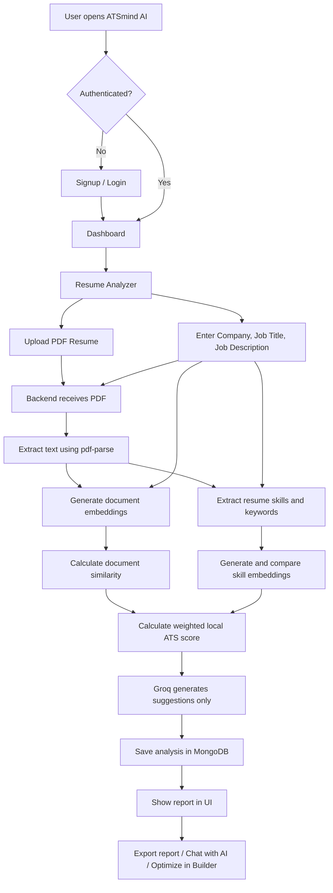
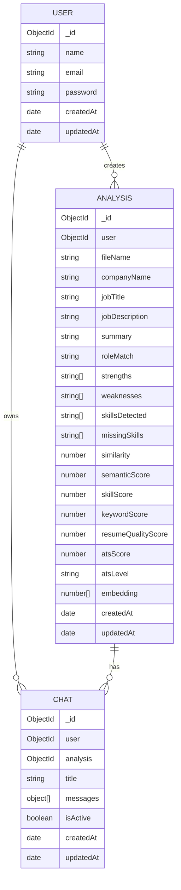
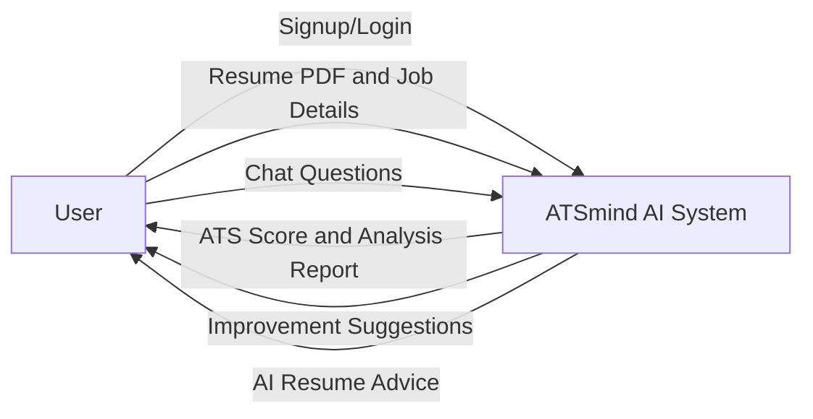
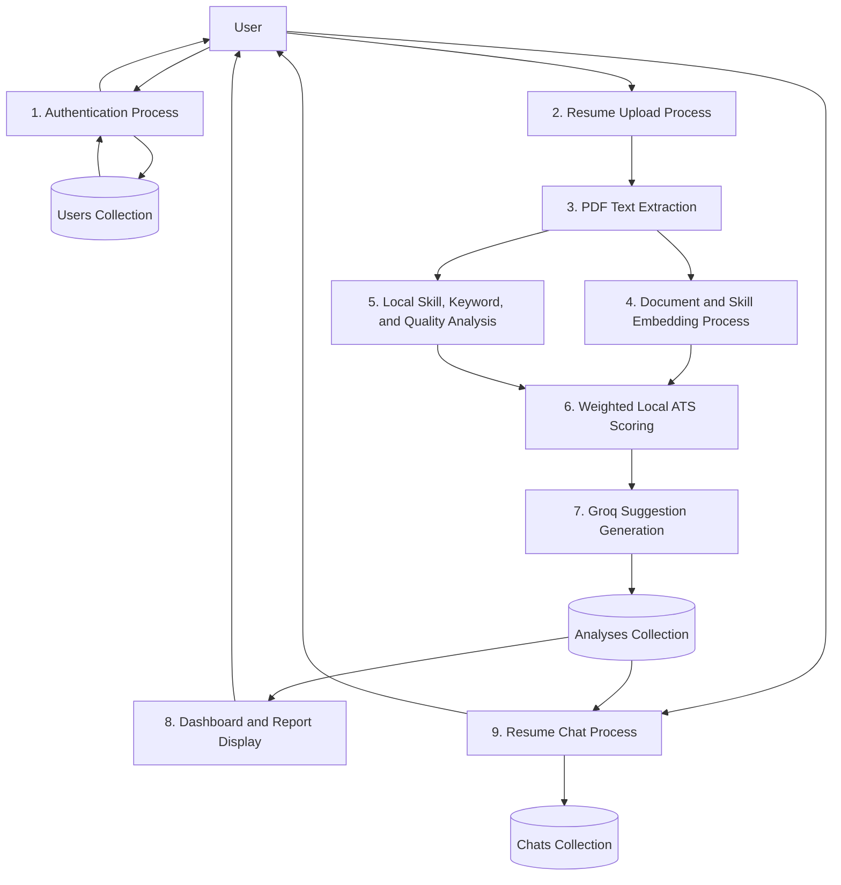
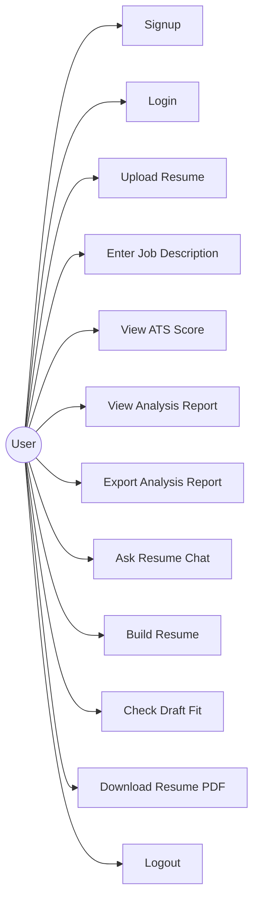
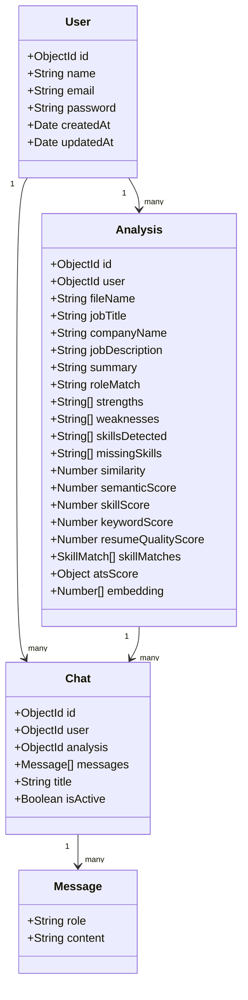

# First Review Presentation Content

## Slide 1: Title

**Project Title:** ATSmind AI - Resume Analyzer and Builder

**Subtitle:** AI based resume analysis, ATS scoring, job matching, and resume improvement platform

**Presented by:** [Your Name]

**Department / Class:** [Your Department]

**Guide / Faculty:** [Guide Name]

---

## Slide 2: Project Overview

ATSmind AI is a web application that helps users analyze, improve, and build resumes. The system allows a user to upload a PDF resume, enter job details, and receive a locally calculated resume analysis with an ATS score, strengths, weaknesses, embedding-assisted skill matches, keyword gaps, and AI-generated improvement suggestions.

The project also includes a resume builder where users can create a structured resume, check its job fit, and download it as a PDF.

**Core idea:** Help candidates understand how well their resume matches a target job and guide them toward an improved, ATS friendly resume.

---

## Slide 3: Project Objectives

- To provide an easy resume upload and analysis system.
- To compare resume content with a target job description.
- To generate a transparent ATS score using local skill, semantic, keyword, and resume-quality signals.
- To identify strengths, weaknesses, detected skills, missing skills, and missing keywords.
- To provide actionable suggestions for resume improvement.
- To save previous resume reports for future review.
- To provide an interactive AI resume advisor chat.
- To allow users to build and export a polished PDF resume.

---

## Slide 4: Technology Stack

**Frontend**

- React 19
- Vite
- Tailwind CSS
- React Router
- Axios
- Lucide React icons
- React PDF / jsPDF for PDF generation and export

**Backend**

- Node.js
- Express.js
- MongoDB with Mongoose
- JWT authentication with HttpOnly cookies
- Multer for PDF upload
- pdf-parse for PDF text extraction
- Groq SDK for improvement suggestions and interactive chat
- Xenova Transformers for local text embeddings

---

## Slide 5: Modules of the Proposed System

| Module | Main Functionality |
|---|---|
| Authentication Module | User signup, login, logout, profile loading, protected routes |
| Resume Upload Module | Upload PDF resume, validate file type and size, send file to backend |
| Resume Parsing Module | Extract readable text from uploaded PDF |
| Local Analysis Module | Generate summary, role match, strengths, weaknesses, keywords, and resume-quality signals |
| Embedding Matching Module | Calculate document similarity and compare extracted job skills with resume skills |
| AI Suggestions Module | Use Groq only to generate actionable improvements from the local findings |
| ATS Scoring Module | Calculate a weighted local score from skills, semantics, keywords, and resume quality |
| Dashboard Module | Show saved analyses, average score, high-fit resumes, search, and filters |
| Analysis Detail Module | View full report, export report, optimize in builder |
| Resume Builder Module | Fill personal, education, experience, projects, and skills sections with live preview |
| Resume Chat Module | Ask questions about a saved analysis using AI and stored context |

---

## Slide 6: Detailed Module Functions

**Authentication**

- Stores user accounts in MongoDB.
- Passwords are hashed using bcrypt.
- JWT token is stored in an HttpOnly cookie for protected API access.

**Resume Analysis**

- Accepts PDF resumes up to 10 MB.
- Extracts text from PDF.
- Extracts skills and keywords locally from the resume and job description.
- Uses Groq only after local analysis to generate improvement suggestions.

**ATS and Semantic Scoring**

- Creates 384-dimensional embeddings using all-MiniLM-L6-v2.
- Compares resume and job description using cosine similarity.
- Generates per-skill embeddings and applies conservative semantic matching within each skill category.
- Final score is calculated as:

```text
ATS Score = (Skill Match * 0.45) + (Semantic * 0.30)
          + (Keyword Coverage * 0.15) + (Resume Quality * 0.10)
```

**Resume Builder**

- Provides multi-step resume form.
- Generates live resume preview.
- Allows draft ATS check.
- Exports resume as PDF.

---

## Slide 7: Workflow Diagram



---

## Slide 8: Methodology / Approach

The project follows a full-stack web application approach.

**Step 1: User Authentication**

- User creates an account or logs in.
- Backend verifies credentials and creates a JWT session.

**Step 2: Resume Input**

- User uploads a PDF resume.
- User optionally enters company name, job title, and job description.

**Step 3: Text Extraction**

- Backend temporarily stores the file.
- PDF text is extracted.
- Uploaded file is deleted after processing.

**Step 4: Local NLP and Embedding Processing**

- Resume and job description embeddings are generated.
- Cosine similarity measures semantic match.
- Skills are extracted using a canonical skill catalogue and aliases.
- Per-skill embeddings provide a conservative semantic fallback for skill matching.
- Keywords and resume-quality signals are calculated locally.

**Step 5: Scoring and Storage**

- Skill, semantic, keyword, and resume-quality scores are combined.
- Groq generates improvement suggestions from the completed local analysis.
- Analysis result and embedding are saved in MongoDB.

**Step 6: Presentation to User**

- User sees ATS score, skills, missing skills, weaknesses, and suggestions.
- User can continue improvement through builder and chat.

---

## Slide 9: Data Collection and Data Analysis

**Data Collected from User**

- Name, email, password for account creation.
- Uploaded resume PDF.
- Company name, job title, and job description.
- Resume builder form data entered by user.
- Chat messages related to resume analysis.

**Data Generated by System**

- Extracted resume text.
- Resume embedding vector.
- Semantic similarity score.
- Embedding-assisted skill score.
- Keyword coverage and resume-quality scores.
- Weighted local ATS score.
- Strengths and weaknesses.
- Detected skills and missing skills.
- Missing keywords.
- Improvement suggestions.
- Saved analysis history.

**Data Analysis Performed**

- PDF text extraction.
- Resume-to-job semantic comparison.
- Keyword and skill gap identification.
- Local role-fit and resume-quality evaluation.
- Weighted ATS score calculation.

---

## Slide 10: Database Design - Collections

The project uses MongoDB as the database. Data is stored using Mongoose models.

**Main Collections**

- `users`
- `analyses`
- `chats`
- `embeddings`

**User Collection**

- Stores user profile and login details.
- Fields: name, email, password, createdAt, updatedAt.

**Analysis Collection**

- Stores full resume analysis report.
- Stores score, skills, suggestions, job details, and embedding vector.

**Chat Collection**

- Stores conversation history for a specific user and resume analysis.

**Embedding Collection**

- Stores user resume text and vector embedding when used independently.

---

## Slide 11: ER Diagram



---

## Slide 12: DFD Level 0 - Context Diagram



---

## Slide 13: DFD Level 1



---

## Slide 14: UML Use Case Diagram



---

## Slide 15: UML Class Diagram



---

## Slide 16: User Interface Design

**1. Landing Page**

- Introduces the system and its main features.
- Provides navigation to analyzer and builder.

**2. Login / Signup Page**

- Allows users to create an account or login.
- Uses protected authentication flow.

**3. Dashboard**

- Shows total analyses, average ATS score, and high-fit resumes.
- Displays saved reports in a searchable and filterable list.

**4. Resume Analyzer Page**

- Has job context inputs: company name, job title, job description.
- Provides PDF upload with drag and drop.
- Displays loading state while analysis is running.

**5. Analysis Result Page**

- Shows ATS score, summary, strengths, weaknesses, skills, missing skills, and suggestions.
- Provides export and optimize actions.

**6. Resume Builder Page**

- Multi-step form for resume sections.
- Live preview of resume.
- Draft ATS check and PDF download.

**7. Floating Resume Chat**

- Chat popup for asking questions about a specific analysis.
- Suggested questions help the user start quickly.

---

## Slide 17: Key Algorithms and Logic

**PDF Parsing**

- The uploaded PDF is read as a file buffer.
- `pdf-parse` extracts text from the document.

**Embedding Generation**

- Resume text and job description are converted into numerical vectors.
- Model used: `Xenova/all-MiniLM-L6-v2`.
- Vector size: 384 dimensions.
- Extracted skills are also embedded and compared within the same skill category.

**Cosine Similarity**

- Measures semantic closeness between resume and job description.
- Output is converted into a semantic score from 0 to 100.

**Local Skill Analysis**

- A curated skill catalogue and aliases identify explicit skills.
- Exact canonical matches are accepted directly.
- A cosine-similarity threshold of 0.92 allows only high-confidence semantic skill matches.
- Missing skills and score components are calculated without Groq.

**Weighted Local ATS Score**

```text
Final ATS Score = 45% Skill Match + 30% Semantic Similarity
                + 15% Keyword Coverage + 10% Resume Quality
```

**AI Suggestions**

- Groq receives the completed local analysis and returns only 4 to 6 improvement suggestions.
- Groq does not determine skills or contribute to the ATS score.

---

## Slide 18: Work Completed Till Date

- Frontend project setup using React and Vite.
- Backend project setup using Node.js and Express.
- MongoDB connection and Mongoose models.
- User signup, login, logout, and protected profile route.
- PDF resume upload using Multer.
- PDF text extraction.
- Groq AI suggestion generation integration.
- Embedding generation using MiniLM model.
- Document and per-skill cosine similarity scoring.
- Local weighted ATS score calculation.
- Analysis storage and retrieval.
- Dashboard with saved reports, search, and filters.
- Detailed analysis report UI.
- Export analysis report as PDF.
- Resume builder with live preview and PDF export.
- Draft resume ATS check from builder.
- Floating AI resume chat with saved chat history.

---

## Slide 19: Work Left / Future Enhancements

- Improve production deployment configuration.
- Add stronger input validation and rate limiting.
- Add email verification and password reset.
- Add support for more resume formats such as DOCX.
- Improve resume builder templates and customization options.
- Add admin panel for monitoring system usage.
- Add analytics for score improvement over time.
- Add vector search for comparing resumes or retrieving similar past analyses.
- Add automated tests for backend APIs and frontend workflows.
- Improve error handling and loading feedback for slow AI responses.

---

## Slide 20: Conclusion

ATSmind AI provides a complete resume improvement workflow from resume upload to local embedding-assisted analysis, ATS scoring, resume building, and personalized chat guidance.

The system calculates its ATS score locally from explainable skill, semantic, keyword, and resume-quality signals. Groq is separated from scoring and is used to turn the local findings into actionable suggestions. The system also stores reports so users can track and improve their resumes over time.

The current implementation completes the major modules required for the first review. The remaining work mainly involves production hardening, testing, deployment, and additional resume customization features.

---

## Short Presentation Script

Good morning respected faculty and classmates. My project is ATSmind AI, an AI based resume analyzer and builder. The purpose of this project is to help users check how well their resume matches a target job description and provide suggestions to improve their ATS score.

The user can create an account, upload a PDF resume, enter job details, and submit it for analysis. The backend extracts text from the PDF, generates document and skill embeddings, calculates cosine similarity, and identifies matched and missing skills locally.

The system calculates the ATS score using 45 percent skill match, 30 percent document similarity, 15 percent keyword coverage, and 10 percent resume quality. Groq does not calculate the score or skills; it only generates improvement suggestions from the local analysis. The report includes summary, role match, strengths, weaknesses, detected skills, missing skills, missing keywords, and suggestions.

The project also includes a dashboard to view saved reports, a detailed analysis page, export functionality, a resume builder with live preview, draft ATS check, and a floating AI chat advisor.

For database design, I used MongoDB with collections for users, analyses, chats, and embeddings. The user is linked to multiple analyses, and each analysis can have a related chat history.

Till now, the main frontend, backend, authentication, resume upload, local embedding analysis, AI suggestions, scoring, dashboard, builder, and chat modules are completed. Future work includes deployment, stronger validation, more resume formats, better templates, admin panel, analytics, and expanded automated testing.

Thank you.
